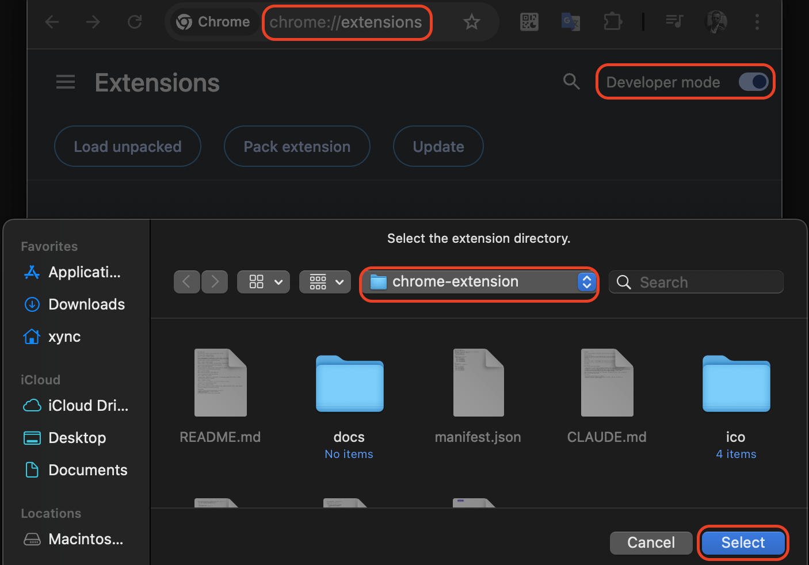
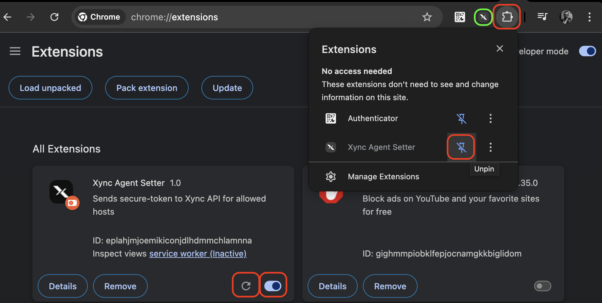

# Xync Agent Setter

Chrome-расширение для передачи токена авторизации Bybit в Xync API.

## Установка в Chrome (режим разработчика)

### Шаг 0. Скачайте и распакуйте расширение

Скачайте архив расширения со страницы релизов на GitHub: **Code → Download ZIP** (или [прямая ссылка](https://github.com/USERNAME/REPO/archive/refs/heads/main.zip)). Распакуйте архив в любую удобную папку.

### Шаг 1. Откройте страницу расширений

Перейдите по адресу `chrome://extensions` или откройте **Menu → Extensions → Manage Extensions**.

### Шаг 2. Включите режим разработчика

Активируйте переключатель **Developer mode** в правом верхнем углу страницы.

### Шаг 3. Загрузите расширение

Нажмите кнопку **Load unpacked** в левом верхнем углу.

### Шаг 4. Выберите папку расширения

В открывшемся диалоге выберите папку `chrome-extension` (эту директорию) и нажмите **Select Folder** / **Open**.

### Шаг 5. Расширение установлено

Расширение появится в списке. Убедитесь, что оно включено (переключатель активен).

### Шаг 6. Закрепите расширение на панели

Нажмите иконку пазла (Extensions) на панели инструментов Chrome и закрепите **Xync Agent Setter**, нажав на булавку.

## Использование

1. Перейдите на [bybit.com](https://www.bybit.com) и авторизуйтесь.
2. Нажмите на иконку расширения на панели инструментов.
3. Нажмите **Send Token**.
4. При успешной отправке отобразится дата истечения токена.
